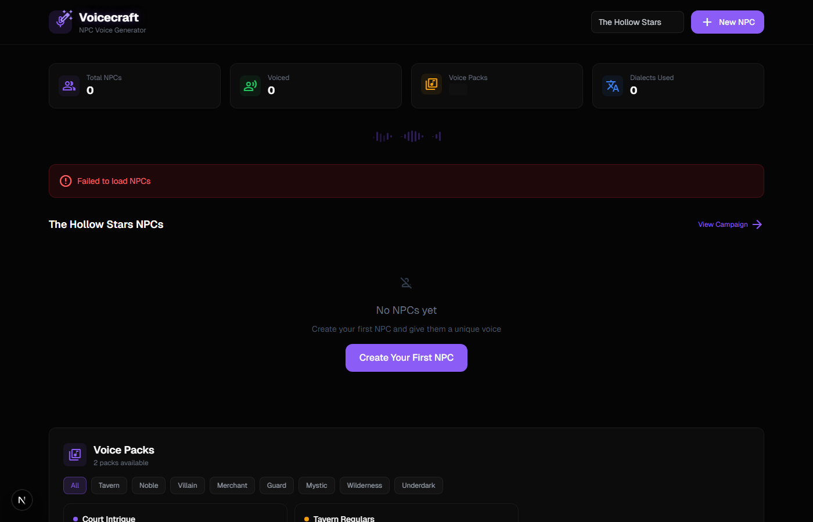
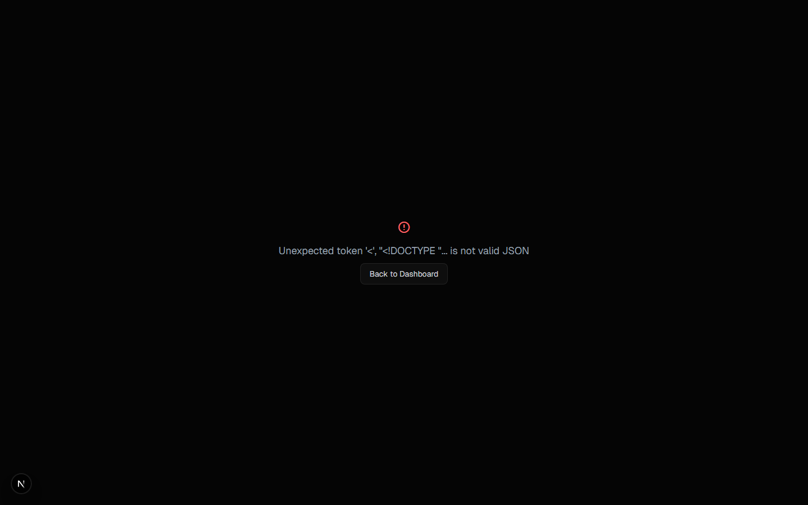
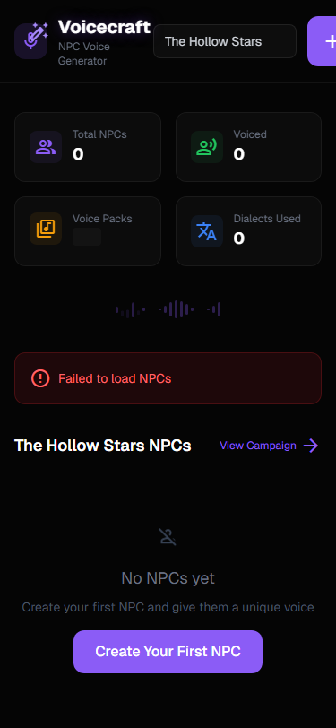

# Voicecraft

### NPC Voice Profile Generator with Coaching Prompts

Voicecraft helps DMs give every NPC a distinct, memorable voice. Mix pitch, tempo, dialect, and speech patterns into unique voice profiles — then get coaching prompts that tell you exactly how to perform each character at the table.

---

## Features

- **Voice Profile Mixer** — Adjust pitch (5 levels), tempo (5 levels), volume (5 levels), and voice quality (7 options) per NPC
- **12 Dialect Options** — From Cockney to Elvish, each dialect comes with pronunciation guides and sample phrases
- **8 Speech Patterns** — Formal, casual, archaic, clipped, flowery, mumbling, booming, and whispering styles
- **Coaching Prompts** — Auto-generated performance tips based on the voice profile configuration
- **Sample Lines** — Editable dialogue samples showing how each NPC would speak in character
- **Voice Packs** — Pre-built template collections (8 templates across 2 packs) for quick NPC voice assignment
- **NPC Voice Comparison** — Side-by-side view of multiple NPC voice profiles for ensuring variety

---

## Screenshots

*Voice profile dashboard with NPC cards and quick-access voice parameters*

*Campaign NPC roster with voice profile summaries and coaching hints*

*Mobile-responsive layout*

---

## Architecture

- Voice profile mixer combines 5+ independent parameters into unique coaching prompts via algorithmic generation
- Campaign, NPC, VoiceProfile, SampleLine, VoicePack, and Template models in Prisma for structured voice data
- 12 RESTful API endpoints covering campaigns, NPCs, voice profiles, sample lines, voice packs, and templates
- Component architecture separates mixer controls, coaching display, and sample line editing for maintainability

---

## Tech Stack

---

## Design Philosophy

> Voicecraft turns "do a funny voice" into a repeatable system. Consistent NPC voices make worlds feel real — this tool makes them achievable.

---

## D&D Toolkit Suite

| Tool | Description |
|------|-------------|
| **[Saga](https://github.com/Jarredkern/saga)** | Campaign management — characters, timelines, badges, session logs |
| **[Loreforge](https://github.com/Jarredkern/loreforge)** | Template-driven worldbuilding — structured prompts for rich settings |
| **[Intrigue](https://github.com/Jarredkern/intrigue)** | NPC relationship mapper — interactive D3.js force-directed network graph |
| **[Oath](https://github.com/Jarredkern/oath)** | Session zero generator — social contracts, safety tools, tone setting |
| **[Outlands](https://github.com/Jarredkern/outlands)** | Hex crawl generator — SVG hex maps with terrain painting and encounters |
| **[Favor](https://github.com/Jarredkern/favor)** | Faction reputation tracker — character-faction heatmap with tier system |
| **Voicecraft** | NPC voice profiles — dialect mixing, coaching prompts, sample dialogue |

---

Built for Dungeon Masters, by a Dungeon Master.

